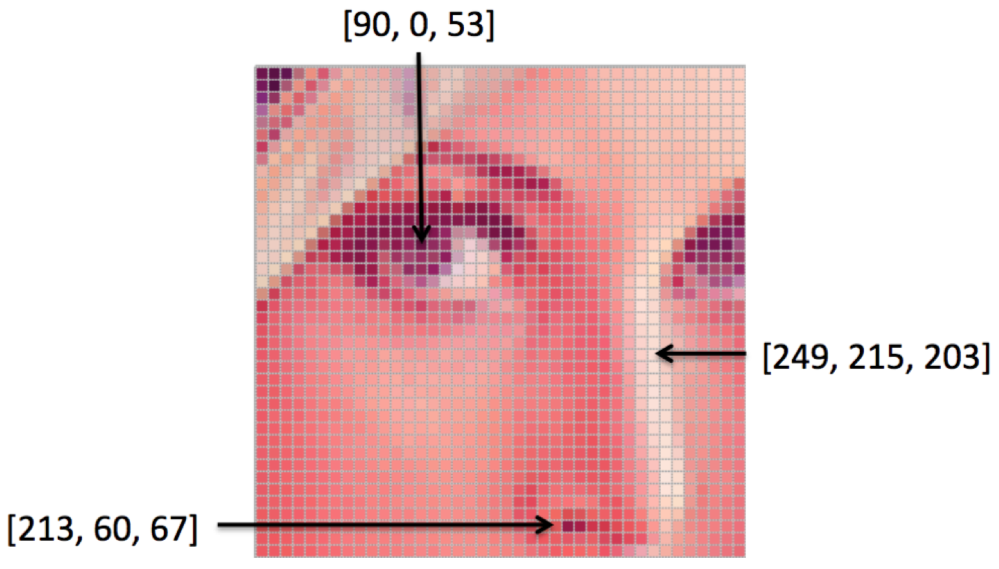
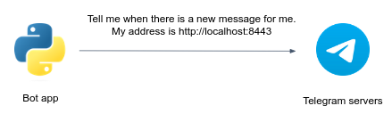

# Image processing service


In this project, you develop an image processing service. 
Clients send images to a Telegram chatbot, and choose a filter to apply:


# Guidelines

## Create a new GitHub repo 

Fork this repo, clone it locally and open it in your favorite IDE (PyCharm, VSCode). 
You can change the `README.md` file content to provide relevant information about your project.


## Intro to image processing

Reference: https://ai.stanford.edu/~syyeung/cvweb/tutorial1.html

### What is a digital image?


If we take a closer look on a digital image, we will notice it comprised of individual pixels, 
each pixel has its own value. For a grayscale image, each pixel would have an **intensity** value between 0 and 255, with 0 being black and 255 being white. 


A grayscale image, then, can be represented as a matrix of pixel values:


A color image is just a simple extension of this. The colors are constructed from a combination of Red, Green, and Blue (RGB). Instead of one matrix of pixel values, we use 3 different matrix, one for the Red (R) values, one for Green (G), and one Blue (B) values. 



As can be seen, each pixel of the image has three channels, represent the red, green, blue values. 

Python-wise, a digital grayscale image is essentially a list of lists:


Each element in the `image` list is a list represented a **row** of pixels. 

### Image filtering

Filtered images are ubiquitous in our social media feeds, news articles, books—everywhere!
Image filtering is a technique in image processing that involves modifying or enhancing an image by applying a filter to it.
Filters can be used to remove noise, sharpen edges, blur or smooth the image, or highlight specific features or details, among other effects.

Python-wise, image filtering is as simple as manipulate the pixel values. 

## Implement image filters

Under `polybot/img_proc.py`, the `Img` class is designed for image filtering on grayscale images.
Here is a detailed usage instruction for the class:

#### Creating an instance of `Img`

Provide the path to the image file as a parameter when creating an instance of the `Img` class, for example:

```python
my_img = Img('path/to/image.jpg')
```

#### Saving the modified image

After performing operations on the image, you can save the modified image using the `save_img()` method, for example:

```python
my_img.save_img()
```

This will save the modified grayscale image to a new path with an appended `_filtered` suffix, and uses the same file extension.

### Filters for you to implement


In this exercise you are required to implement **at least one** filter from the below list (`concat()`, `rotate()`, `salt_n_pepper()`, `segment()`).
You have to implement the filter using **Python builtin functionality only**. Don't use external packages like numpy, Pillow, openVC, etc. 

On every error (e.g. image path doesn't exist, input image is not an RGB) you should raise a `RuntimeError` exception.


#### Concatenating images

The `concat()` method is meant to concatenate two images together horizontally (side by side).


Implementation instruction for horizontal concatenation:   
- Check the dimensions of both images to ensure they are compatible for concatenation. If the dimensions are not compatible (e.g., different heights), raise a `RuntimeError` exception with informative message.
- Combine the pixel values of both images to create a new image. For horizontal concatenation, combine each row of the first image with the corresponding row of the second image.
- Store the resulting concatenated image in the `self.data` attribute of the instance. 

```python
my_img = Img('path/to/image.jpg')
another_img = Img('path/to/image2.jpg')
my_img.concat(another_img) 
my_img.save_img()   # concatenated image was saved in 'path/to/image_filtered.jpg'
```

Note: you can optionally use the `direction` argument to implement `vertical` concatenation as well.

#### Adding "salt and pepper" noise to the image

The `salt_n_pepper()` noise method applies a type of image distortion that randomly adds isolated pixels with value of either 255 (maximum white intensity) or 0 (minimum black intensity).
The name "salt and pepper" reflects the appearance of these randomly scattered bright and dark pixels, resembling grains of salt and pepper sprinkled on an image.

Implementation instruction:   
 1. Iterate over the pixels of the image by looping through each row and each pixel value.
 2. For each pixel in the image:
     - Randomly generate a number between 0 and 1.
     - If the random number is less than 0.2, set the pixel value to the maximum intensity (255) to represent salt.
     - If the random number is greater than 0.8, set the pixel value to the minimum intensity (0) to represent pepper.
     - If neither condition is met (the random number is in between 0.2 to 0.8), keep the original pixel value without any modification.


```python
my_img = Img('path/to/image.jpg')
my_img.salt_n_pepper() 
my_img.save_img()  # noisy image was saved in 'path/to/image_filtered.jpg'
```

#### Rotating the image

The `rotate()` method rotates an image around its center in a clockwise direction.
    
Implementation remarks:   
The resulting rotated image will have its rows become the columns, and the columns will become the rows. The pixels in the rotated image will be repositioned based on a clockwise rotation around the center of the original image. For example, the first row in the original image will become the last column in the rotated image, the second row will become the second-to-last column, and so on.  

```python
my_img = Img('path/to/image.jpg')
my_img.rotate() 
my_img.rotate()  # rotate again for a 180 degrees rotation
my_img.save_img()   # rotated image was saved in 'path/to/image_filtered.jpg'
```

#### Segmenting the image

The `segment()` method partitions the image into regions where the pixels have similar attributes, so the image is represented in a more simplified manner, and so we can then identify objects and boundaries more easily.

Implementation instruction:   
 1. Iterate over the pixels of the image by looping through each row and each pixel value.
 2. All pixels with an intensity greater than 100 are replaced with a white pixel (intensity 255) and all others are replaced with a black pixel (intensity 0). 

```python
my_img = Img('path/to/image.jpg')
my_img.segment() 
my_img.save_img()
```

### Filters for inspiration

The below two filters was already implemented, you can review these functions to get some inspiration of how might a filter implementation look like. 

#### Blurring the image

The `blur()` method is already implemented. You can control the blurring level `blur_level` argument (default is 16).
   It blurs the image by replacing the value of each pixel by the average of the 16 pixels around him (or any other value, controlled by the `blur_level` argument. The bigger the value, the stronger the blurring level).

```python
my_img = Img('path/to/image.jpg')
my_img.blur()   # or my_img.blur(blur_level=32) for stronger blurring effect
my_img.save_img()
```

#### Creating a contour of the image

The `contour()` method is already implemented. It applies a contour effect to the image by calculating the **differences between neighbor pixels** along each row of the image matrix.

```python
my_img = Img('path/to/image.jpg')
my_img.contour() 
my_img.save_img()
```

### Test your filters locally

Under `polybot/test` you'll find unittests for each filter.

For example, to execute the test suite for the `concat()` filter, run the below command from the root dir of your repo:

```bash
python -m polybot.test.test_concat
```

An alternative way is to run tests from the Pycharm UI. 

## Create a Telegram Bot

1. <a href="https://desktop.telegram.org/" target="_blank">Download</a> and install telegram desktop (you can use your phone app as well).
2. Once installed, create your own Telegram Bot by following <a href="https://core.telegram.org/bots/features#botfather">this section</a> to create a bot. Once you have your telegram token you can move to the next step.

**Never** commit your telegram token in Git repo, even if the repo is private.
For now, we will provide the token as an environment variable to your chat app. 
Later on in the course we will learn better approaches to store sensitive data.

## Running the Telegram bot locally

The Telegram app is a flask-based service that responsible for providing a chat-based interface for users to interact with your image processing functionality. 
It utilizes the Telegram Bot API to receive user images and respond with processed images. 

The code skeleton for the bot app is already given to you under `polybot/app.py`.
In order to run the server, you have to [provide 2 environment variables](https://www.jetbrains.com/help/objc/add-environment-variables-and-program-arguments.html#add-environment-variables):

1. `TELEGRAM_TOKEN` which is your bot token.
2. `TELEGRAM_APP_URL` which is your app public URL provided by Ngrok (will be discussed soon).

Implementing bot logic involves running a local Python script that listens for updates from Telegram servers.
When a user sends a message to the bot, Telegram servers forward the message to the Python app using a method called **webhook** (**long-polling** and **websocket** are other possible methods which wouldn't be used in this project).
The Python app processes the message, executes the desired logic, and may send a response back to Telegram servers, which then delivers the response to the user.

The webhook method consists of simple two steps:

Setting your chat app URL in Telegram Servers:



Once the webhook URL is set, Telegram servers start sending HTTPS POST requests to the specified webhook URL whenever there are updates, such as new messages or events, for the bot. 


You've probably noticed that setting `localhost` URL as the webhook for a Telegram bot can be problematic because Telegram servers need to access the webhook URL over the internet to send updates.
As `localhost` is not accessible externally, Telegram servers won't be able to reach the webhook, and the bot won't receive any updates.

[Ngrok](https://ngrok.com/) can solve this problem by creating a secure tunnel between the local machine (where the bot is running) and a public URL provided by Ngrok.
It exposes the local server to the internet, allowing Telegram servers to reach the webhook URL and send updates to the bot.

Sign-up for the Ngrok service (or any another tunneling service to your choice), then install the `ngrok` agent as [described here](https://ngrok.com/docs/getting-started/#step-2-install-the-ngrok-agent). 

Authenticate your ngrok agent. You only have to do this once:

```bash
ngrok config add-authtoken <your-authtoken>
```

Since the telegram bot service will be listening on port `8443`, start ngrok by running the following command:

```bash
ngrok http 8443
```

Your bot public URL is the URL specified in the `Forwarding` line (e.g. `https://16ae-2a06-c701-4501-3a00-ecce-30e9-3e61-3069.ngrok-free.app`).
Don't forget to set the `TELEGRAM_APP_URL` env var to your URL. 

In the next step you'll finally run your bot app.

## Running a simple "echo" Bot - the `Bot` class

Under `polybot/bot.py` you are given a class called `Bot`. This class implements a simple telegram bot, as follows.

The constructor `__init__` receives the `token` and `telegram_chat_url` arguments.
The constructor creates an instance of the `TeleBot` object, which is a pythonic interface to Telegram API. You can use this instance to conveniently communicate with the Telegram servers.
Later, the constructor sets the webhook URL to be the `telegram_chat_url`. 

The `polybot/app.py` is the main app entrypoint. It's nothing but a simple flask webserver that uses a `Bot` instance to handle incoming messages, caught in the `webhook` endpoint function.

The default behavior of the `Bot` class is to "echo" the incoming messages. Try it out!

## Extending the echo bot - the `QuoteBot` class

In `bot.py` you are given a class called `QuoteBot` which **inherits** from `Bot`.
Upon incoming messages, this bot echoing the message while quoting the original message, unless the user is asking politely not to quote.

In `app.py`, change the instantiated instance to the `QuoteBot`:

```python
- Bot(TELEGRAM_TOKEN, TELEGRAM_APP_URL)
+ QuoteBot(TELEGRAM_TOKEN, TELEGRAM_APP_URL)
```

Run this bot and check its behavior.

## Build your image processing bot - the `ImageProcessingBot` class

In `bot.py` you are given a class called `ImageProcessingBot` which **inherits** from `Bot`, again.
Upon incoming **photo messages**, this bot downloads the photos and processes them according to the **`caption`** field provided with the message.
The bot will then send the processed image to the user.

A few notes:

- Inside the `ImageProcessingBot` class, override `handle_message` method and implement the needed functionality.
- Remember that by inheriting the `Bot` class, you can use all of its methods (such as `send_text`, `download_user_photo`, `send_photo`...). 
- Possible `caption` values are: `['Blur', 'Contour', 'Rotate', 'Segment', 'Salt and pepper', 'Concat']`.

**Note**: Your bot should support the `Blur` and `Contour` filters (those filters have already implemented for you). 

Test your bot on real photos and make sure it's functioning properly.

## Test your bot locally

You can test your bot logic locally by:

```bash
python -m polybot.test.test_telegram_bot
```

Or via the Pycharm UI. 


## Extend your bot functionality

Add any functionality you wish to your bot...

- Greet the user.
- Add some informative message when user sends photos without captions or with invalid caption value.
- Add your own filters.
- Extend the functionality of the filters, e.g. allow users to specify "Rotate 2" to rotate the image twice).

**Go wild!!!** 


## Submission 


You don't need to send anything as we already have access to your fork (make sure your forked repo is public).
You will be graded by the automated tests running in GitHub action **in your fork**, make sure you pass them.


## Good luck
